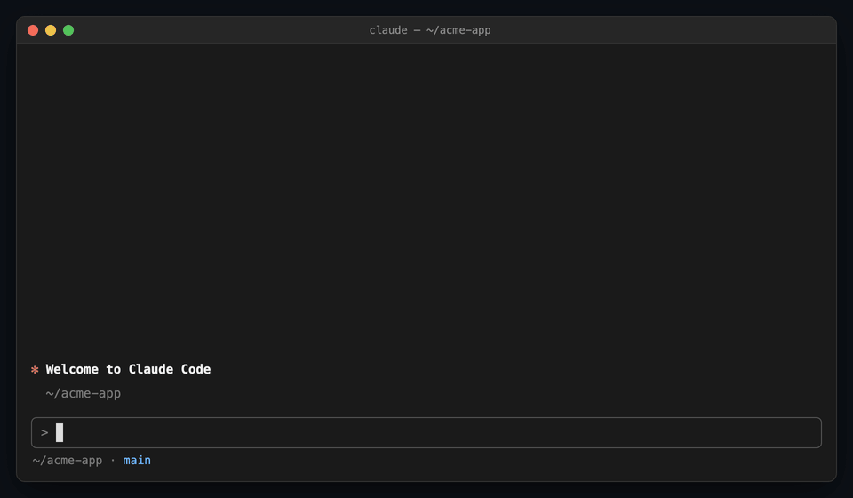
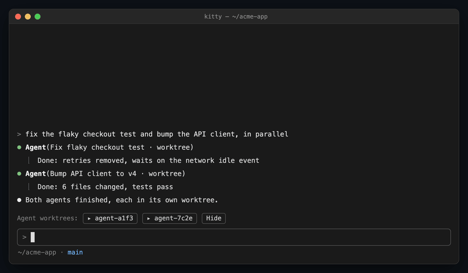

# claude-plugins

Bruno Carneiro's Claude Code plugins, as one marketplace.

| Plugin | In one line |
| --- | --- |
| [prototype-mode](#prototype-mode) | Turn off git worktrees for a project: Claude iterates and commits right on the current branch. |
| [worktree-terminal](#worktree-terminal) | Open a shell in the worktree Claude or its agents are working in, as a split, tab or window. |

```
/plugin marketplace add brunolca/claude-plugins
/plugin install prototype-mode@brunolca
/plugin install worktree-terminal@brunolca
```

## prototype-mode



Background jobs and isolated subagents normally work in a git worktree on their own branch. That's what you want for real work. For a throwaway prototype, it means branches to merge and changes you can't see in your editor. `/proto on` turns it off for one project:

- **Edits land in your checkout**, on whatever branch is checked out, `main` included. Background jobs too.
- **Claude commits as it goes**, with short messages, and still asks before pushing.
- **No worktrees:** `EnterWorktree` is refused, and subagents run in the shared checkout.
- **`🧪 prototype mode`** in the status line while it's on.

| Command | Effect |
| --- | --- |
| `/proto on` | On for you only (`.claude/settings.local.json`) |
| `/proto on team` | On for everyone (`.claude/settings.json`, commit it) |
| `/proto off [team]` | Back to worktrees |
| `/proto` | Shows whether it's on, and which file says so |

More in the [plugin README](plugins/prototype-mode).

## worktree-terminal



When agents run with `isolation: "worktree"`, their changes live in `.claude/worktrees/<name>`, out of sight. worktree-terminal opens a shell right there, next to Claude, so you can run the tests, read the diff or start the app on an agent's branch.

- **`/term`** opens a terminal in the session's directory (its worktree, once Claude entered one).
- **`/term list`** lists the repo's worktrees, agents' marked; **`/term 2`**, **`/term main`** or **`/term <name>`** opens one.
- **One button per agent worktree** above the prompt, while any exist.
- **Your terminal, detected:** a split in tmux, Zellij, kitty, WezTerm or iTerm2; a tab or window in Ghostty, Warp, Alacritty, GNOME Terminal, Konsole and Terminal.app. Override with `--split`, `--tab` or `--window`.
- **Runs at once**, even while Claude is mid-turn.

More in the [plugin README](plugins/worktree-terminal), including what each terminal needs.

## Install

The commands at the top run in Claude Code; from a shell:

```sh
claude plugin marketplace add brunolca/claude-plugins
claude plugin install prototype-mode@brunolca
claude plugin install worktree-terminal@brunolca
```

Update with `claude plugin marketplace update brunolca`, then `/reload-plugins`.

## Develop

Each plugin lives in `plugins/<name>/`. Load one from disk for a session with `claude --plugin-dir plugins/<name>`, and check it with:

```sh
claude plugin validate plugins/<name>
claude plugin test plugins/<name>
```

CI runs both for every plugin on each push. To add a plugin, create `plugins/<name>/` and add its entry to `.claude-plugin/marketplace.json`.

The demo GIFs are HTML mockups rendered by `node docs/demo/render.mjs` (needs Google Chrome and ffmpeg); edit the scenes there and re-run it.

## License

MIT
